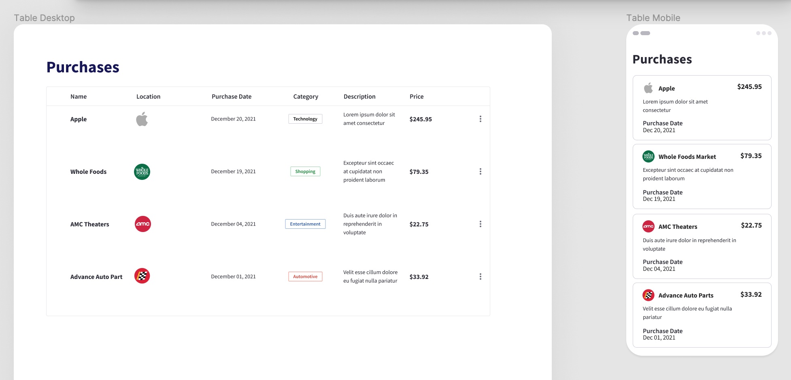

# Getting Started with Create React App

This project was bootstrapped with [Create React App](https://github.com/facebook/create-react-app).

## Take Home Exercise

[Frontend-Interview.pdf](Frontend-Interview.pdf)

## How to run the application

In the project directory, you can run:
1. `git clone git@github.com:tanya-ladnik/id-me.git`
2. `npm install`
3. `npm start`

Runs the app in the development mode.\
Open [http://localhost:3000](http://localhost:3000) to view it in your browser.

The page will reload when you make changes.\
You may also see any lint errors in the console.
